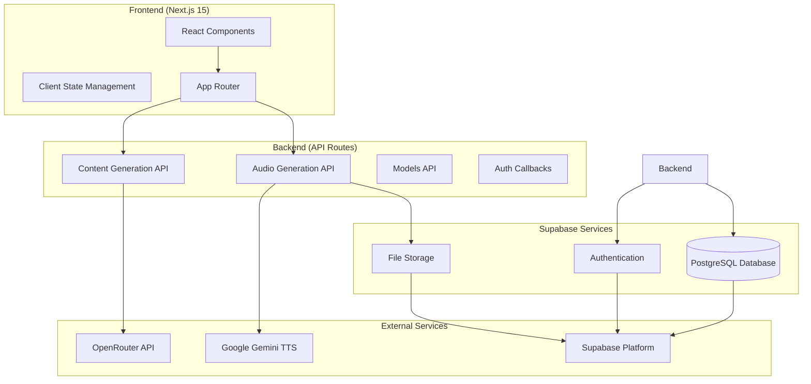
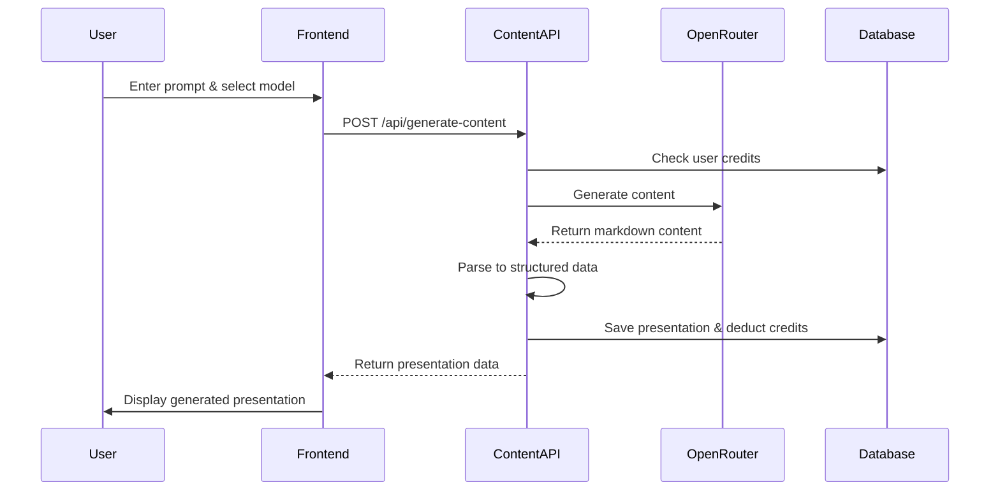
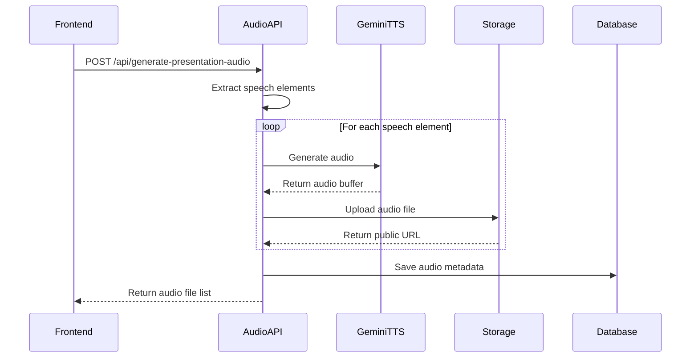

# Design Document

## Overview

Presi5 is architected as a modern full-stack Next.js application with a serverless backend, leveraging Supabase for authentication, database, and file storage. The system integrates multiple AI services (OpenRouter for content generation, Google Gemini TTS for audio) to create a seamless presentation generation pipeline. The architecture follows a component-based design with clear separation of concerns between UI, business logic, and data persistence.

## Architecture

### High-Level Architecture



### Technology Stack

- **Frontend Framework**: Next.js 15.3.5 with App Router
- **UI Framework**: React 19.0.0 with TypeScript
- **Styling**: Tailwind CSS v4 with PostCSS
- **Authentication**: Supabase Auth
- **Database**: PostgreSQL via Supabase
- **File Storage**: Supabase Storage
- **AI Content Generation**: OpenRouter API (multiple models)
- **Text-to-Speech**: Google Gemini TTS
- **Deployment**: Vercel Platform

## Components and Interfaces

### Frontend Components

#### 1. Authentication Components
- **WelcomePage**: Landing page with feature overview and registration CTA
- **LoginPage**: User authentication form
- **RegisterPage**: New user registration form
- **AuthCallback**: Handles OAuth callback processing

#### 2. Main Application Components
- **HomeClient**: Main presentation generation interface
- **InputInterface**: User input form with model selection
- **PresentationViewer**: Fullscreen presentation playback
- **DashboardClient**: User presentation management
- **ProfileClient**: User profile and credit management

#### 3. Shared Components
- **Header**: Navigation and user status
- **LoadingIndicators**: Various loading states
- **ErrorBoundaries**: Error handling and display

### Backend API Interfaces

#### 1. Content Generation API (`/api/generate-content`)
```typescript
interface ContentGenerationRequest {
  prompt: string;
  model: string;
}

interface ContentGenerationResponse {
  success: boolean;
  data?: PresentationContent;
  presentation_id?: string;
  credits_remaining?: number;
  error?: string;
}
```

#### 2. Audio Generation API (`/api/generate-presentation-audio`)
```typescript
interface AudioGenerationRequest {
  presentationId: string;
  content: PresentationContent;
}

interface AudioGenerationResponse {
  success: boolean;
  audioFiles?: AudioFile[];
  message?: string;
  partialFailure?: boolean;
  error?: string;
}
```

#### 3. Models API (`/api/models`)
```typescript
interface ModelsResponse {
  success: boolean;
  data?: ModelOption[];
  error?: string;
}

interface ModelOption {
  value: string;
  label: string;
}
```

### Service Layer Interfaces

#### 1. Content Generator Service
```typescript
interface PresentationContent {
  title: string;
  slides: PresentationSlide[];
  totalSlides: number;
}

interface PresentationSlide {
  id: string;
  title: string;
  content: string;
  elements: SlideElement[];
}

interface SlideElement {
  id: string;
  type: 'title' | 'subtitle' | 'content' | 'bullet-list' | 'bullet-point' | 'speech';
  content: string;
  animation: string;
  delay: number;
  order: number;
}
```

#### 2. Audio Batch Generator Service
```typescript
interface AudioFile {
  slideId: string;
  elementId?: string;
  elementOrder?: number;
  audioPath: string;
  audioUrl: string;
  duration?: number;
}

interface BatchAudioResult {
  presentationId: string;
  audioFiles: AudioFile[];
  totalDuration: number;
  status: 'success' | 'error';
  error?: string;
}
```

## Data Models

### Database Schema

#### 1. Profiles Table
```sql
CREATE TABLE profiles (
    id UUID PRIMARY KEY REFERENCES auth.users(id),
    username TEXT UNIQUE,
    full_name TEXT,
    avatar_url TEXT,
    website TEXT,
    credits INTEGER DEFAULT 10,
    created_at TIMESTAMP WITH TIME ZONE DEFAULT NOW(),
    updated_at TIMESTAMP WITH TIME ZONE DEFAULT NOW()
);
```

#### 2. Presentations Table
```sql
CREATE TABLE presentations (
    id UUID PRIMARY KEY DEFAULT gen_random_uuid(),
    user_id UUID REFERENCES profiles(id) ON DELETE CASCADE,
    title TEXT NOT NULL,
    content JSONB NOT NULL,
    markdown_content TEXT,
    created_at TIMESTAMP WITH TIME ZONE DEFAULT NOW(),
    updated_at TIMESTAMP WITH TIME ZONE DEFAULT NOW(),
    is_public BOOLEAN DEFAULT false,
    audio_generated BOOLEAN DEFAULT false
);
```

#### 3. Audio Files Table
```sql
CREATE TABLE audio_files (
    id UUID PRIMARY KEY DEFAULT gen_random_uuid(),
    presentation_id UUID REFERENCES presentations(id) ON DELETE CASCADE,
    file_name TEXT NOT NULL,
    file_path TEXT NOT NULL,
    element_id TEXT NOT NULL,
    element_order INTEGER NOT NULL,
    duration REAL,
    created_at TIMESTAMP WITH TIME ZONE DEFAULT NOW()
);
```

#### 4. User Credits Table
```sql
CREATE TABLE user_credits (
    id UUID PRIMARY KEY DEFAULT gen_random_uuid(),
    user_id UUID REFERENCES profiles(id) ON DELETE CASCADE,
    credits_used INTEGER NOT NULL,
    action_type TEXT NOT NULL,
    description TEXT,
    created_at TIMESTAMP WITH TIME ZONE DEFAULT NOW()
);
```

### Data Flow Architecture

#### 1. Content Generation Flow


#### 2. Audio Generation Flow


## Error Handling

### Error Categories and Strategies

#### 1. Authentication Errors
- **Strategy**: Redirect to login page with appropriate message
- **Implementation**: Middleware-level authentication checks
- **User Experience**: Clear messaging about authentication requirements

#### 2. Credit Insufficient Errors
- **Strategy**: Prevent action and display credit purchase options
- **Implementation**: Pre-flight credit checks before expensive operations
- **User Experience**: Clear credit balance display and usage warnings

#### 3. AI Service Errors
- **Strategy**: Graceful degradation with fallback models
- **Implementation**: Try-catch blocks with model fallback logic
- **User Experience**: Transparent error messages with retry options

#### 4. Audio Generation Errors
- **Strategy**: Partial success handling - continue with available audio
- **Implementation**: Individual element error handling in batch processing
- **User Experience**: Allow presentation viewing even with partial audio failures

#### 5. Network and Storage Errors
- **Strategy**: Retry mechanisms with exponential backoff
- **Implementation**: Service-level retry logic with circuit breakers
- **User Experience**: Loading states with progress indicators

### Error Response Format
```typescript
interface ErrorResponse {
  success: false;
  error: string;
  code?: string;
  details?: string;
  retryable?: boolean;
}
```

## Testing Strategy

### Unit Testing
- **Service Layer**: Test content generation, audio processing, and data transformation logic
- **Utility Functions**: Test markdown parsing, HTML conversion, and validation functions
- **API Routes**: Test request/response handling and error scenarios

### Integration Testing
- **Database Operations**: Test CRUD operations with real database connections
- **External API Integration**: Test OpenRouter and Gemini TTS service integration
- **Authentication Flow**: Test Supabase Auth integration and user session management

### End-to-End Testing
- **User Workflows**: Test complete presentation generation and playback flows
- **Cross-Browser Compatibility**: Test presentation viewer across different browsers
- **Mobile Responsiveness**: Test interface adaptation on various screen sizes

### Performance Testing
- **Load Testing**: Test system behavior under concurrent user load
- **Audio Generation Performance**: Test batch audio processing efficiency
- **Database Query Optimization**: Test query performance with large datasets

### Testing Tools and Framework
- **Unit Tests**: Jest with React Testing Library
- **Integration Tests**: Custom Node.js test scripts (existing in `/tests` directory)
- **E2E Tests**: Playwright or Cypress for browser automation
- **Performance Tests**: Artillery or k6 for load testing

### Existing Test Infrastructure
The project already includes comprehensive testing setup:
- `/tests/test-environment.js` - Environment validation
- `/tests/test-audio-generation.js` - Audio service testing
- `/tests/test-integration.js` - Full integration testing
- `/tests/run-all-tests.js` - Test orchestration

## Security Considerations

### Authentication and Authorization
- **Row Level Security (RLS)**: Implemented on all database tables
- **JWT Token Validation**: Supabase handles token verification
- **API Route Protection**: All sensitive endpoints require authentication

### Data Protection
- **Input Validation**: All user inputs are validated and sanitized
- **SQL Injection Prevention**: Using Supabase client with parameterized queries
- **XSS Prevention**: React's built-in XSS protection with proper content handling

### File Storage Security
- **Access Control**: Audio files are stored with user-specific paths
- **Public URL Management**: Controlled access through Supabase Storage policies
- **File Type Validation**: Audio files are validated before storage

### API Security
- **Rate Limiting**: Implement rate limiting on expensive operations
- **CORS Configuration**: Proper CORS setup for API endpoints
- **Environment Variables**: Sensitive keys stored in environment variables

## Performance Optimization

### Frontend Performance
- **Code Splitting**: Next.js automatic code splitting
- **Image Optimization**: Next.js Image component for optimized loading
- **Caching Strategy**: Browser caching for static assets

### Backend Performance
- **Database Indexing**: Proper indexes on frequently queried columns
- **Connection Pooling**: Supabase handles database connection pooling
- **Caching**: Consider Redis for frequently accessed data

### Audio Processing Performance
- **Batch Processing**: Parallel audio generation for multiple elements
- **Streaming**: Consider streaming audio generation for large presentations
- **Compression**: Audio file compression for faster loading

### Monitoring and Analytics
- **Error Tracking**: Implement error tracking service (Sentry)
- **Performance Monitoring**: Monitor API response times and database queries
- **User Analytics**: Track user engagement and feature usage